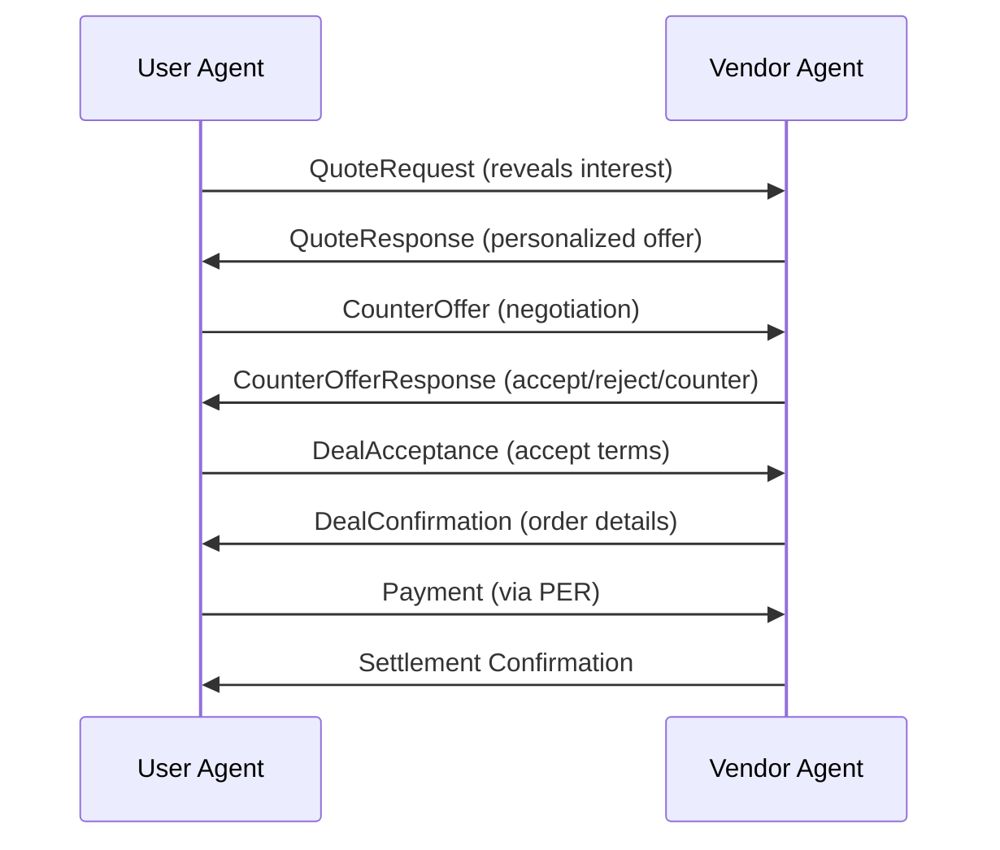
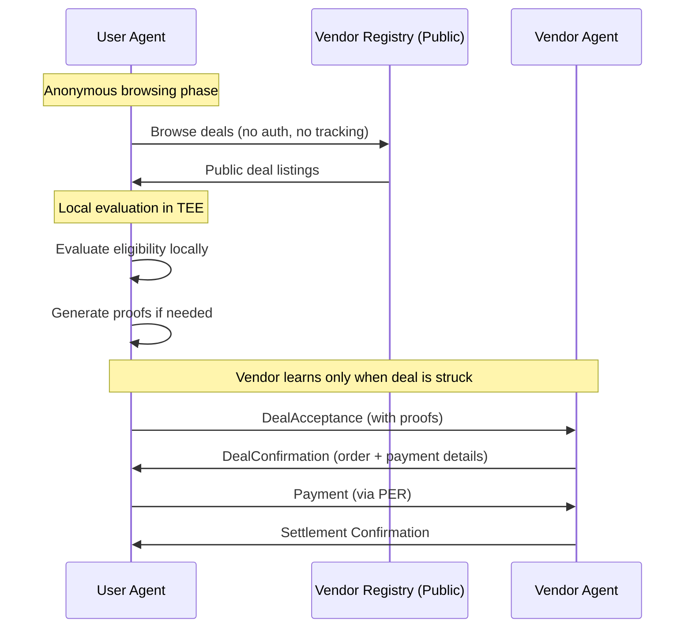

# X.402 Protocol Overview

The **X.402 Protocol** is Sen's agent-to-agent communication standard for autonomous negotiation and payment execution. Inspired by HTTP 402 Payment Required, X.402 extends the concept for autonomous agent-driven commerce.

## Vision

**Off-chain negotiated, on-chain settled** - Agents negotiate deals privately and quickly off-chain, then settle final terms on-chain for security and immutability.

## Core Principles

1. **Agent Autonomy** - Agents negotiate on behalf of users without constant human intervention
2. **Privacy-First** - Negotiations happen privately, vendors learn details only when deals are struck
3. **Efficient Discovery** - Agents browse deals anonymously before revealing interest
4. **Trustless Settlement** - Final payments settled on blockchain for verifiability

## Protocol Architecture

```
┌─────────────────────────────────────────────────────────────┐
│                     User Agent (TEE)                         │
│  - Browses deals anonymously                                 │
│  - Evaluates eligibility locally                             │
│  - Initiates negotiation when ready                          │
│  - Generates privacy proofs                                  │
│  - Executes payments via PER                                 │
└──────────────────┬──────────────────────────────────────────┘
                   │ X.402 Protocol
                   │ (HTTP + JSON)
                   ▼
┌─────────────────────────────────────────────────────────────┐
│                    Vendor Agent (HTTP)                       │
│  - Posts deals to public registry                            │
│  - Receives quote requests                                   │
│  - Generates personalized offers                             │
│  - Accepts/rejects counter-offers                            │
│  - Confirms orders & provides tracking                       │
└─────────────────────────────────────────────────────────────┘
```

## Protocol Flow

### Legacy Flow (DEPRECATED - Reveals Interest Too Early)



**Problem**: Vendor learns about user interest even if no purchase is made.

### Privacy-First Flow (CURRENT)



**Benefits**:
- ✅ Vendor learns about user only when purchase happens
- ✅ Anonymous browsing protects user privacy
- ✅ Local evaluation prevents tracking
- ✅ Proofs reveal only necessary information

## Message Types

### 1. QuoteRequest (Legacy)

User agent requests pricing from vendor.

```typescript
interface QuoteRequest {
  requestId: string;
  timestamp: number;

  service: {
    type: 'product' | 'service' | 'subscription';
    category: string;
    description: string;
    quantity?: number;
  };

  // Privacy-preserving signals (optional)
  userSignals?: {
    ltvTier?: 'high' | 'medium' | 'low';
    loyaltyTier?: 'champion' | 'loyal' | 'regular';
    inProximity?: boolean;
  };

  negotiable: boolean;
  expiresAt: number;
}
```

[Full specification →](messages/quote-request.md)

### 2. QuoteResponse

Vendor provides personalized offer.

```typescript
interface QuoteResponse {
  quoteId: string;
  requestId: string;
  vendorId: string;

  pricing: {
    basePrice: number;
    discounts: Discount[];
    finalPrice: number;
  };

  availability: {
    inStock: boolean;
    estimatedDelivery?: number;
  };

  negotiable: boolean;
  validUntil: number;
}
```

[Full specification →](messages/quote-response.md)

### 3. CounterOffer

User agent proposes alternative terms.

```typescript
interface CounterOffer {
  counterOfferId: string;
  quoteId: string;

  proposedPrice?: number;
  reason?: string;

  // Privacy-preserving proofs (NEW)
  proofs?: {
    ltvProof?: ZKProof;
    loyaltyProof?: CommitmentProof;
    proximityProof?: LocationProof;
  };

  validUntil: number;
}
```

[Full specification →](messages/counter-offer.md)

### 4. DealAcceptance

User agent accepts vendor's offer (privacy-first entry point).

```typescript
interface DealAcceptance {
  acceptanceId: string;
  quoteId: string; // Or dealId for privacy-first flow

  agreedPrice: number;
  paymentMethod: 'per' | 'external' | 'x402';

  // Privacy-preserving proofs
  proofs?: {
    ltvProof?: ZKProof;
    loyaltyProof?: CommitmentProof;
  };

  // x402 payment session (NEW)
  x402SessionId?: string;
}
```

[Full specification →](messages/deal-acceptance.md)

### 5. DealConfirmation

Vendor confirms order and provides payment details.

```typescript
interface DealConfirmation {
  confirmationId: string;
  acceptanceId: string;

  confirmed: boolean;

  paymentDetails: {
    recipient: string; // Wallet address or endpoint
    amount: number;
    tokenMint?: string;
  };

  orderId?: string;
  trackingInfo?: string;

  x402TxHash?: string; // Settlement transaction
}
```

[Full specification →](messages/deal-confirmation.md)

## Payment Methods

X.402 supports multiple payment methods:

### 1. PER (Private Ephemeral Rollups) - Recommended

**Privacy**: Highest - Payments happen in TEE, invisible to blockchain

```typescript
paymentMethod: 'per'
```

**Flow**:
1. User agent sends payment via MagicBlock PER
2. Transfer executes in TEE
3. No on-chain transaction
4. Vendor receives payment from Sen treasury (batched)

### 2. External Wallet

**Privacy**: Low - Public blockchain transaction

```typescript
paymentMethod: 'external'
```

**Flow**:
1. User pays from external wallet (MetaMask, Phantom, etc.)
2. Direct on-chain transfer to vendor
3. Public blockchain record

### 3. x402 Payment Session (Hybrid)

**Privacy**: Medium - Aggregated settlement

```typescript
paymentMethod: 'x402',
x402SessionId: 'sess_abc123'
```

**Flow**:
1. Multiple small payments aggregated
2. Single settlement transaction to vendor
3. Individual payments stay private
4. Vendor sees aggregate only

## Negotiation Strategies

### Auto-Negotiation

Agents can negotiate automatically based on market data:

```typescript
const negotiator = new X402Negotiator({
  config: {
    autoNegotiate: true,
    maxNegotiationRounds: 3,
    minSavingsToNegotiate: 5, // $5
  }
});

// Agent automatically negotiates if potential savings > $5
await negotiator.requestQuote({ vendorId, service });
```

### Manual Approval

Users can review offers before accepting:

```typescript
const quotes = await negotiator.compareVendors({
  vendorIds: ['vendor1', 'vendor2', 'vendor3'],
  service: { type: 'product', category: 'coffee' }
});

// Show quotes to user for approval
const selected = await userSelectsQuote(quotes);

await negotiator.acceptOffer(selected.sessionId);
```

[Full negotiation guide →](negotiation.md)

## Privacy-Preserving Proofs

Users can prove eligibility without revealing sensitive data:

### LTV Threshold Proof

Prove spending is above threshold without revealing exact amount:

```typescript
const ltvProof = await ltvScorer.generateThresholdProof({
  category: 'coffee',
  threshold: 100, // $100/month
  vendorId: 'highlands-coffee'
});

// Vendor learns: "User spends >$100/month on coffee"
// Vendor does NOT learn: Exact spending amount
```

### Loyalty Tier Proof

Prove loyalty status without revealing full purchase history:

```typescript
const loyaltyProof = await loyalty.generateVendorSignal({
  vendorId: 'highlands-coffee',
  category: 'coffee'
});

// Vendor learns: "User is 'loyal' tier"
// Vendor does NOT learn: Exact purchase count, dates, amounts
```

### Proximity Proof

Prove nearby location without revealing exact coordinates:

```typescript
const proximityProof = await loyalty.generateProximityProof({
  center: { lat: 10.7769, lng: 106.7009 }, // Vendor location
  radius: 1000, // 1km
  name: 'Quận 1, HCMC'
});

// Vendor learns: "User is within 1km"
// Vendor does NOT learn: Exact GPS coordinates
```

[Full proofs documentation →](../marketplace/discovery/proofs.md)

## Security Features

### 1. TEE Attestation

Agents prove they run in genuine TEEs:

```typescript
const attestation = await agent.generateAttestation();

// Vendor verifies agent is running in Intel TDX
const verified = await verifyTEEAttestation(attestation);
```

### 2. Message Authentication

All messages signed with agent keys:

```typescript
const signature = await agent.signMessage(dealAcceptance);

// Vendor verifies authenticity
const verified = await verifyAgentSignature(
  dealAcceptance,
  signature,
  agentPublicKey
);
```

### 3. Replay Protection

Nonces prevent message replay attacks:

```typescript
interface Message {
  nonce: string; // Unique per message
  timestamp: number;
  expiresAt: number;
}
```

## Error Handling

X.402 uses standard HTTP status codes:

| Code | Meaning | Action |
|------|---------|--------|
| 200 | Success | Continue flow |
| 402 | Payment Required | Execute payment |
| 403 | Deal Expired | Request new quote |
| 404 | Vendor Not Found | Try different vendor |
| 429 | Rate Limited | Back off & retry |
| 500 | Vendor Error | Retry or escalate |

## Integration Example

### User Agent

```typescript
import { X402Negotiator, DealDiscovery } from '@sen-protocol/sdk';

// Initialize negotiator
const negotiator = new X402Negotiator({
  userId: 'user123',
  agentId: 'agent456',
  config: { autoNegotiate: true }
});

// Privacy-first flow: Browse anonymously
const discovery = new DealDiscovery();
const deals = await discovery.browseDeals({
  category: 'coffee',
  maxPrice: 10
});

// Evaluate locally
const eligible = deals.filter(deal =>
  discovery.evaluateEligibility(deal, userProfile)
);

// Initiate purchase (vendor learns only now)
const confirmation = await negotiator.initiatePurchase({
  deal: eligible[0],
  paymentMethod: 'per',
  includeProofs: true
});
```

### Vendor Agent

```typescript
import { VendorRegistry } from '@sen-protocol/sdk';

// Post deal to public registry
const registry = new VendorRegistry();
await registry.postDeal({
  vendorId: 'highlands-coffee',
  service: {
    type: 'product',
    category: 'coffee',
    description: 'Premium Vietnamese Coffee'
  },
  pricing: {
    basePrice: 5.00,
    discountedPrice: 4.00, // 20% off
    currency: 'USD'
  },
  requirements: {
    minLTV: 50, // High-value coffee buyers
    loyaltyTier: 'loyal',
    proximityRequired: true,
    proximityRadius: 2000 // 2km
  }
});

// Handle incoming purchase
app.post('/x402/accept', async (req, res) => {
  const acceptance = req.body as DealAcceptance;

  // Verify proofs
  const ltvVerified = await verifyLTVProof(acceptance.proofs.ltvProof);

  if (ltvVerified) {
    const confirmation = await createOrder(acceptance);
    res.json(confirmation);
  } else {
    res.status(403).json({ error: 'Proof verification failed' });
  }
});
```

## Performance Characteristics

| Metric | Target | Notes |
|--------|--------|-------|
| Quote generation | <100ms | Vendor response time |
| Negotiation round | <200ms | Including network RTT |
| Payment execution | <2s | PER transfer time |
| Settlement | <5s | On-chain confirmation |
| Multi-vendor comparison | <5s | Parallel quote requests |

## Roadmap

### Current (Q4 2024)

- ✅ Privacy-first deal discovery
- ✅ Anonymous browsing
- ✅ Local eligibility evaluation
- ✅ Privacy-preserving proofs (LTV, loyalty)

### Near-term (Q1 2025)

- zkSNARK proofs for LTV
- Ring signatures for proximity
- Multi-round negotiation optimization
- Batch payment settlement

### Long-term (Q2-Q3 2025)

- Cross-chain X.402 support
- Decentralized vendor registry
- Reputation system with privacy
- Advanced AI negotiation strategies

## Learn More

- [Message Types](messages.md)
- [Payment Flow](payment-flow.md)
- [Privacy Guarantees](privacy.md)
- [Negotiation Strategies](negotiation.md)
- [API Reference](../api/agent-api.md)
